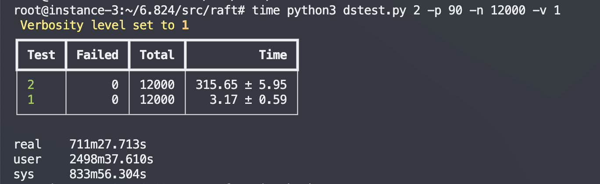

## lab2 raft

12核8G的谷歌云ESC运行的测试结果:

经过12000次测试， 单次测试完成时间平均为315.65s，低于lab规定的360秒

VERBOSE=1 go test -run TestFigure8Unreliable2C|python3 dslogs.py -c 5

python3 dstest.py 2 -p 12 -n 12 -v 1

参考:

1. 日志:https://blog.josejg.com/debugging-pretty
2. 性能:https://zhuanlan.zhihu.com/p/396363069

